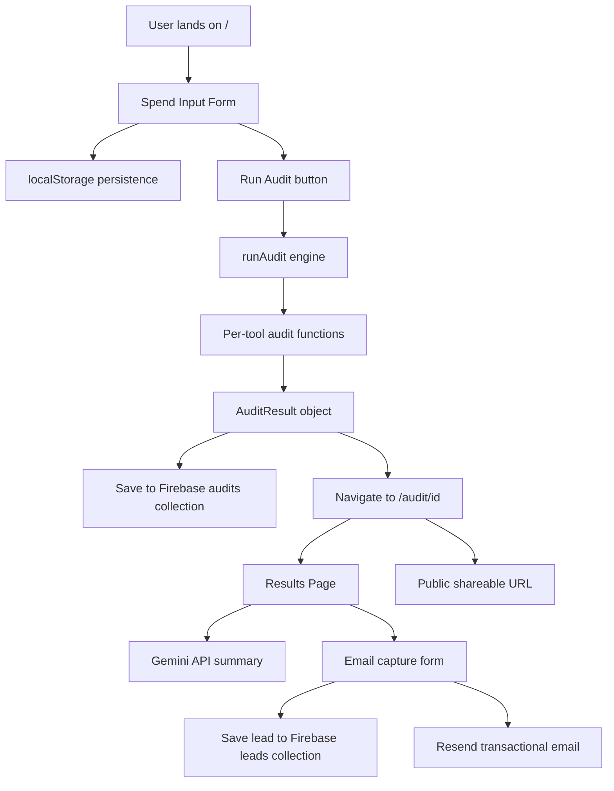

# ARCHITECTURE.md

## System Diagram

## Data Flow

1. User fills spend input form on `/`
2. Form state persists to localStorage on every change
3. User hits "Run Audit" → `runAudit(formData)` is called
4. Audit engine loops through each tool entry, routes to tool-specific function
5. Each function evaluates 4 criteria: overprovisioned seats, cheaper same-vendor plan, cheaper alternative tool, Credex credits opportunity
6. Results collected into `AuditResult` object with total savings
7. Result saved to Firebase + localStorage, user navigated to `/audit/[id]`
8. Results page loads — fetches from localStorage first, Firebase fallback for shared URLs
9. Gemini API called to generate personalized 100-word summary
10. User optionally enters email → saved to Firebase leads, Resend sends confirmation email

## Stack Choice

- **Next.js App Router** — chosen for file-based routing, API routes, and easy Netlify deployment. TypeScript throughout for type safety.
- **Tailwind CSS** — utility-first, fast to build with, no custom CSS overhead
- **Firebase Firestore** — simple NoSQL, free tier sufficient for MVP, no backend server needed
- **Resend** — simplest transactional email API, free tier covers MVP volume
- **Gemini API** — free tier available, sufficient for summary generation with fallback

## Trade-offs Made

1. **Hardcoded audit rules over AI** — audit logic uses if/else rules, not LLM. More predictable, defensible, and cheaper. AI only used for the summary paragraph.

2. **localStorage + Firebase dual storage** — localStorage for instant load, Firebase for shareable URLs. Trade-off: slight data duplication.

3. **Team size as proxy for usage intensity** — we don't have actual usage data from vendor APIs. Team size is the best available proxy. A future version could integrate vendor APIs directly.

4. **Single use case per audit** — users pick one primary use case for the whole team. Reality is more nuanced but keeps the form simple for MVP.

5. **No authentication** — no login required by design. Reduces friction, increases completion rate. Trade-off: no persistent user accounts.

6. **Resend free tier limitation** — email sending restricted to verified email addresses without domain verification. In production, a verified domain would be added to enable sending to all users.

## Scaling to 10k Audits/Day

- Move audit engine to edge functions for lower latency
- Add Redis caching for audit results — avoid repeated Firebase reads for shared URLs
- Rate limit the `/api/summary` route — Gemini API has quotas
- Add a queue for email sending — Resend rate limits at scale
- Add proper analytics (Plausible or PostHog) to track funnel metrics
- Firebase Firestore scales automatically but would need index optimization for querying leads

## Abuse Protection

Honeypot field on email capture form. Hidden from real users via CSS, but bots auto-fill it. If the field has a value on submission, the request is silently rejected. Chosen over rate limiting or hCaptcha for simplicity and zero friction for real users.